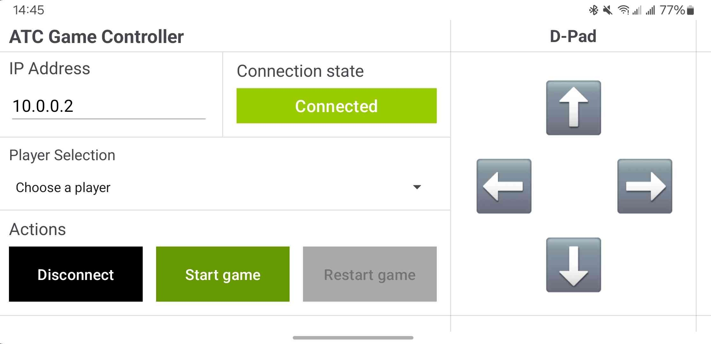

# ATCGameController
A simple game controller written for an Android client for a game running on an ESP8266 microcontroller. 

## Introduction
This project was made specifically for one of my University projects, where the main goal was to develop some kind of project using microcontrollers.
I decided to make a simple game running on an ESP8266 microcontroller and also having a controller both using an Android device and an EFM8BB3 microcontroller, a game pad, and with another ESP8266.

The game this controller was made for is a recreation of the classic game "Pong", where each player has to control a paddle to prevent the ball from hitting the wall behind it. This game was developed using the NodeMCU framework with the game being written entirely in Lua, and the controller was developed using Keil C51 and the EFM8BB3 library from SiLabs. 

This controller here was developed using Android Studio and Java as a secondary controller for the game, since one of our controllers had an technical issue with it's UART module.

## Build
To build this Android project, you will need to have Android Studio installed on your computer.<br>
After that, you can clone this repository and open it in Android Studio. 
```
git clone https://github.com/dnigamer/ATCGameController
```

After cloning the repository, you can build the project and run it on your Android device.

## Interface
The interface is rather simple. Assumes that the ESP is at the IP address 10.0.0.1 and that you're already connected to the ESP's network. If you're not, you can connect to it by going to your WiFi settings and connecting to the network named "ESP8266_AP".

### Screenshot


### Main Interface
The interface is divided into two parts: the configuration part and the D-Pad part:
- The configuration part is where you can set which player you are, or which side of the screen you want to control. **DISCLAIMER:** The IP of the ESP is hardcoded to the previous mentioned IP, and port is 80.
- Still in the configuration part, you can do normal things like connecting and disconnecting from the ESP, and also starting, stopping or restarting the game.
- The D-Pad part is where you can control the paddle. The D-Pad is divided into 4 buttons: Up, Down, Left, and Right. The Up and Down buttons control the vertical movement of the paddle, and the Left and Right buttons, well, in my case, they don't do anything.

## Command format
The type of connection to the ESP is an **UDP connection**, so the messages are sent as datagrams. You can check how the messages are sent in the ``ESPConnection`` class.

The commands are sent to the ESP in JSON format. The commands are divided into two categories: movement and game control. There's also an acknowledgment message that the ESP sends back to the controller when it receives an initial connection message.

In the following sections, I'll explain the format of each command and what they do.

### Initial connection
The initial connection message is sent to the ESP with the following format:
```json
{
    "type": "init",
    "msg": "Android client connected"
}
```
After receiving this message, the ESP sends back an acknowledgment message with the following format:
```json
{
    "type": "init",
    "msg": "acknowledged"
}
```
With this message, the controller knows that the ESP is ready to receive commands.

**NOTE:** If the ESP doesn't send this message back, the controller will wait for 5 seconds and then fail the connection and also show a quick Toast message. The user can then try to connect again.

### Game control
#### Player selection
The player selection message is sent to the ESP with the following format:
```json
{
    "command": "setplayer",
    "player": 1
}
```
Where the ``"player"`` field can be 1 or 2. The ESP will then associate the controller IP with the player number. Currently, the ESP doesn't really do anything with this association of IP and player number, but it's useful for debugging purposes.

If the player wants to stop controlling the paddle, they can send the following message:
```json
{
    "command": "removeplayer",
    "player": 1
}
```
Where the ``"player"`` field can be 1 or 2. The ESP will then remove the association of the controller IP with the player number.

#### Game control
The game control messages are sent to the ESP with the following format:
```json
{
    "command": "startgame"
}
```
This message tells the ESP to **start the game**. The ESP will then start the game loop and start sending the game state to the controller.

If the player wants to **stop the game**, they can send the following message:
```json
{
    "command": "stopgame"
}
```
This message tells the ESP to stop the game. The ESP will then stop the game loop and stop sending the game state to the controller.

If the player wants to **restart the game**, they can s end the following message:
```json
{
    "command": "restartgame"
}
```
This message tells the ESP to restart the game. The ESP will then reset the game state and start the game loop again.

### Movement
Each button sends a message to the ESP with the following format:
```json
{
    "command": "move", 
    "direction": "up", 
    "player": 1, 
    "pressed": true
}
```
Where the ``"direction"`` field can be ``"up"``, ``"down"``, ``"left"``, or ``"right"``, and the "player" field can be 1 or 2. The "pressed" field is a boolean that tells the ESP if the button is pressed or not. This is useful for the ESP to know when to stop moving the paddle, because we might want to keep moving the paddle to some place and not have to do multiple clicks to get there.

## License
This project is licensed under the MIT License - see the [LICENSE](LICENSE) file for details.
